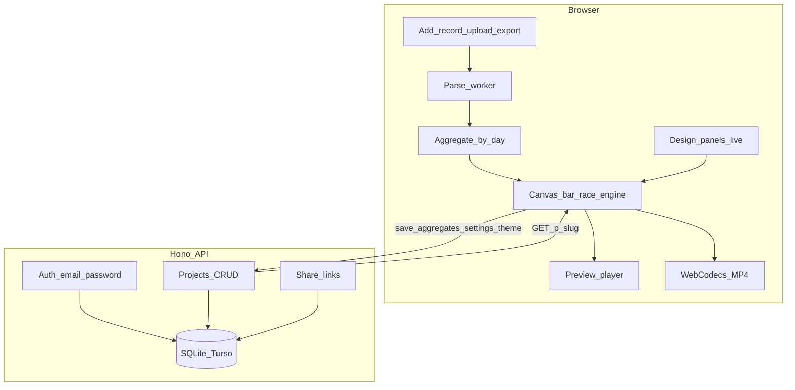

# Telegram Chat Bar Race

Корень проекта: `C:\Projects\telegraphic`

Документы-источники истины:

- `docs/PRD.md` — полная продуктовая спецификация + **канонические имена полей** (`Project`, `Record`, `Settings`, `Theme`, `ShareLink`)
- `docs/STITCH_DESIGN_GUIDE.md` — задание для дизайн-агента в Google Stitch
- `docs/DEVELOPMENT_PLAN.md` — пошаговый план автономной разработки и тестирования

## Решения (зафиксировано, обновлено 17.07.2026)

- Данные: экспорт Telegram Desktop (`result.json` / ZIP); **один экспорт = один `Record`**, записи добавляются по одной через Data → Add record
- `settings.topN` настраиваемый (дефолт 15), `settings.smoothingDays` настраиваемое
- Аватары: ручная загрузка → `Record.avatarDataUrl` (ресайз до ~128px на клиенте)
- Превью + MP4 в браузере (WebCodecs, fallback MediaRecorder), один canvas: `render(ctx, project, tSec)`
- Auth: email + password, cookie sessions; без OAuth в MVP
- Шаринг: view-only `ShareLink` с длинным `slug`, URL `/p/:slug` (не project `id`); create / list / revoke
- Главная страница: проекты пользователя в стиле Google Drive
- Редактор: Figma-подобная бесконечная плоскость (pan/zoom); панели Total / Data / Share слева, Design справа; плеер снизу
- Backend: Hono + SQLite локально / Turso (libSQL) в проде
- Деплой: Vercel (фронт — static, API — functions), preview-деплои на PR
- Язык интерфейса: английский; UI-лейблы экспорта: **Download a video**
- Дизайн: Google Stitch через Stitch MCP; UI-токены из DESIGN.md; рейтинг потребляет `project.theme`

## Архитектура



**Клиент** — единственный источник правды для анимации и экспорта (один canvas-движок).
**Сервер** — auth, CRUD `Project` (агрегаты + `settings` + `theme` + метаданные, без сырых сообщений), `ShareLink`.

## Стек

| Часть | Выбор |
|-------|--------|
| Repo | pnpm monorepo: `apps/web`, `apps/api`, `packages/shared` (типы, парсер, движок) |
| Frontend | Vite + React + TypeScript |
| State | Zustand (`project` incl. `settings`/`theme`/`records`, `playback`, `editorCanvas`) |
| Анимация | Canvas 2D bar-race, `render(ctx, project, tSec)` |
| Парсинг | Web Worker (ZIP/JSON → дневные cumulative серии) |
| MP4 | WebCodecs + `mp4-muxer`; fallback `canvas.captureStream` + MediaRecorder |
| Backend | Hono; SQLite (dev) / Turso libSQL (prod); сессии в cookie |
| Тесты | Vitest (unit), Playwright (e2e + visual snapshots канваса) |
| Деплой | Vercel: static frontend + serverless API; preview на PR |

## Модель данных проекта

Канон — в `docs/PRD.md` §2. Кратко:

```ts
type Project = {
  id: string
  ownerId: string
  title: string
  createdAt: string
  updatedAt: string
  ticks: string[] // ISO dates
  records: Record[] // title, sourceChatTitle, color?, nameColor?, avatarDataUrl?, visible, counts[]
  settings: Settings // topN, dateStart, dateEnd, scalePercent, screenWidth/Height,
                     // speedMode: "totalLength"|"daysPerSecond", speedValue,
                     // startDelaySec, finishDelaySec, smoothingDays
  theme: Theme // background, timer, card — см. PRD
}

type ShareLink = {
  id: string
  projectId: string
  slug: string // публичный URL: /p/:slug
  createdAt: string
  revokedAt?: string
}
```

Сырые сообщения на сервер **не** уходят — только агрегаты.

## Главные риски

| Риск | Решение |
|------|----------|
| Огромный export | Worker, только агрегаты, предупреждение о больших ZIP |
| Safari без WebCodecs | MediaRecorder fallback, честный UI-нотис |
| Расхождение preview/export | Один canvas-движок для обоих |
| Тяжёлые аватары | Ресайз до ~128px WebP/JPEG на клиенте |
| Privacy | Только агрегаты, секретные длинные `slug`, noindex |
| Figma-подобный canvas UX сложен | Ограничить: один объект на плоскости, только pan/zoom/select |

## Вне MVP

- MTProto / логин в Telegram, автоподтягивание аватаров из экспорта
- Совместное редактирование, ссылки с правом записи
- Серверный рендеринг видео (Remotion/FFmpeg)
- Биллинг, публичная галерея
